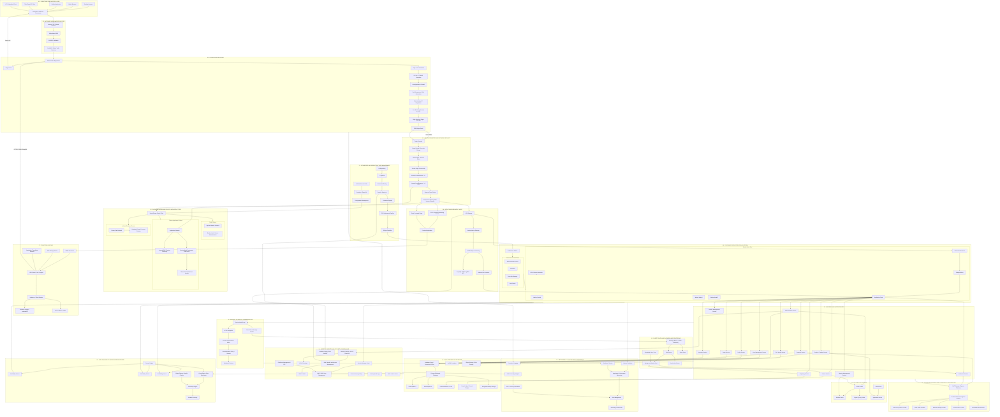

```mermaid

flowchart TB

%% =====================================================
%% 1. CLIENT / USER ACCESS LAYER
%% =====================================================

subgraph CLIENT["01 - CLIENT AND USER ACCESS LAYER"]
    U1["Desktop Browser"]
    U2["Mobile Browser"]
    U3["Mobile Application"]
    U4["Third Party API Client"]
    U5["IoT / Embedded Client"]

    U1 --> USER
    U2 --> USER
    U3 --> USER
    U4 --> USER
    U5 --> USER
    USER["End Users / External Consumers"]
end

%% =====================================================
%% 2. INTERNET AND DNS
%% =====================================================

subgraph INTERNET["02 - INTERNET AND NAME RESOLUTION"]
    DNS["Authoritative DNS"]
    DNSSEC["DNSSEC Validation"]
    GEO["GeoDNS / Global Traffic Steering"]
    INTERNET_GW["Internet / ISP / Global Network"]
end

USER --> INTERNET_GW
INTERNET_GW --> DNS
DNS --> DNSSEC
DNSSEC --> GEO

%% =====================================================
%% 3. GLOBAL EDGE INFRASTRUCTURE
%% =====================================================

subgraph EDGE["03 - GLOBAL EDGE NETWORK"]
    CDN["Global CDN / Edge PoPs"]
    CACHE_EDGE["Edge Cache"]
    EDGE_TLS["Edge TLS Termination"]
    DDOS["L3 / L4 / L7 DDoS Protection"]
    WAF["Web Application Firewall"]
    BOT["Bot Management / Anti Automation"]
    RATE["Rate Limiting / IP Reputation"]
    GEO_BLOCK["Geo Blocking / Access Policies"]
    EDGE_ROUTER["Edge Routing / Origin Selection"]
    ORIGIN_SHIELD["CDN Origin Shield"]

    CDN --> CACHE_EDGE
    CDN --> EDGE_TLS
    EDGE_TLS --> DDOS
    DDOS --> WAF
    WAF --> BOT
    BOT --> RATE
    RATE --> GEO_BLOCK
    GEO_BLOCK --> EDGE_ROUTER
    EDGE_ROUTER --> ORIGIN_SHIELD
end

GEO --> CDN

%% Cache hit and cache miss
CACHE_EDGE -->|Cache HIT| USER
ORIGIN_SHIELD -->|Cache MISS| INTERNET_ORIGIN

%% =====================================================
%% 4. PUBLIC ORIGIN AND PERIMETER
%% =====================================================

subgraph PERIMETER["04 - ORIGIN PERIMETER AND NETWORK SECURITY"]
    INTERNET_ORIGIN["Origin Endpoint"]
    ORIGIN_FIREWALL["Cloud Firewall / Security Groups"]
    PRIVATE_ORIGIN["Private Origin Connectivity"]
    NETWORK_ACL["Network ACL / Subnet Rules"]
    EXT_LB["External Load Balancer - L7"]
    INT_LB["Internal Load Balancer - L4 / L7"]
    REVERSE_PROXY["Reverse Proxy Cluster"]
    INGRESS["Kubernetes Gateway API / Ingress Gateway"]

    INTERNET_ORIGIN --> ORIGIN_FIREWALL
    ORIGIN_FIREWALL --> NETWORK_ACL
    NETWORK_ACL --> PRIVATE_ORIGIN
    PRIVATE_ORIGIN --> EXT_LB
    EXT_LB --> INT_LB
    INT_LB --> REVERSE_PROXY
    REVERSE_PROXY --> INGRESS
end

ORIGIN_SHIELD --> INTERNET_ORIGIN

%% =====================================================
%% 5. CLOUD NETWORK / VPC
%% =====================================================

subgraph CLOUD["05 - CLOUD NETWORK AND PRIVATE INFRASTRUCTURE"]
    VPC["Virtual Private Cloud / VNet"]

    subgraph PUBLIC_SUBNET["Public Subnet"]
        NAT_INGRESS["Ingress Network Interface"]
        BASTION["Bastion Host / Secure Administration"]
    end

    subgraph PRIVATE_APP["Private Application Subnet"]
        APP_NETWORK["Application Network"]
        SERVICE_DISCOVERY["Internal DNS / Service Discovery"]
        MESH["Service Mesh Control and Data Plane"]
        MTLS["Mutual TLS / Workload Identity"]
    end

    subgraph PRIVATE_DATA["Isolated Database Subnet"]
        DB_NETWORK["Private Data Network"]
        DB_FIREWALL["Database Firewall / Access Policies"]
    end

    VPC --> PUBLIC_SUBNET
    VPC --> PRIVATE_APP
    VPC --> PRIVATE_DATA
    APP_NETWORK --> SERVICE_DISCOVERY
    APP_NETWORK --> MESH
    MESH --> MTLS
    DB_NETWORK --> DB_FIREWALL
end

INGRESS --> VPC
INT_LB --> APP_NETWORK

%% =====================================================
%% 6. APPLICATION DELIVERY
%% =====================================================

subgraph APPLICATION["06 - APPLICATION DELIVERY LAYER"]
    API_GW["API Gateway"]
    AUTH_GATEWAY["Authentication Gateway"]
    API_ROUTER["API Routing / Versioning"]
    SSR["SSR / Frontend Rendering Server"]
    STATIC_ORIGIN["Static Frontend Origin"]
    FRONTEND["Frontend Application"]
    BFF["Backend For Frontend"]
    GRAPHQL["GraphQL / REST / gRPC API"]

    API_GW --> AUTH_GATEWAY
    AUTH_GATEWAY --> API_ROUTER
    API_ROUTER --> BFF
    API_ROUTER --> GRAPHQL
    SSR --> FRONTEND
    STATIC_ORIGIN --> FRONTEND
end

INGRESS --> API_GW
INGRESS --> SSR
INGRESS --> STATIC_ORIGIN

%% =====================================================
%% 7. FRONTEND RUNTIME
%% =====================================================

subgraph FRONTEND_RUNTIME["07 - FRONTEND RUNTIME"]
    HTML["HTML Document"]
    CSS["CSS / Design Assets"]
    JS["JavaScript / TypeScript Bundles"]
    SPA["SPA / React / Vue / Angular"]
    HYDRATION["Hydration / Client Runtime"]
    BROWSER_STORAGE["Browser Storage / IndexedDB"]
    SERVICE_WORKER["Service Worker / PWA"]

    HTML --> SPA
    CSS --> SPA
    JS --> SPA
    SPA --> HYDRATION
    HYDRATION --> BROWSER_STORAGE
    HYDRATION --> SERVICE_WORKER
end

FRONTEND --> HTML

%% Browser makes API calls
SPA -->|HTTPS / JSON / GraphQL| CDN

%% =====================================================
%% 8. KUBERNETES / CONTAINER PLATFORM
%% =====================================================

subgraph PLATFORM["08 - CONTAINER ORCHESTRATION PLATFORM"]
    K8S["Kubernetes Cluster"]

    subgraph CONTROL_PLANE["Kubernetes Control Plane"]
        API_SERVER["Kubernetes API Server"]
        SCHEDULER["Scheduler"]
        CONTROLLER["Controller Manager"]
        ETCD["etcd Cluster"]
    end

    subgraph WORKER_NODES["Worker Node Pool"]
        NODE1["Worker Node A"]
        NODE2["Worker Node B"]
        NODE3["Worker Node C"]

        PODS["Application Pods"]
        K8S_SERVICE["Kubernetes Services"]
        ENDPOINTS["EndpointSlices"]
        AUTOSCALER["HPA / Cluster Autoscaler"]
    end

    K8S --> CONTROL_PLANE
    CONTROL_PLANE --> WORKER_NODES
    K8S_SERVICE --> ENDPOINTS
    ENDPOINTS --> PODS
    AUTOSCALER --> WORKER_NODES
end

API_GW --> K8S_SERVICE
BFF --> PODS

%% =====================================================
%% 9. MICROSERVICES / BACKEND
%% =====================================================

subgraph BACKEND["09 - BACKEND AND MICROSERVICES"]
    AUTH["Authentication Service"]
    USER_SERVICE["User Management Service"]
    PROFILE["Profile Service"]
    SESSION["Session Management Service"]
    PRODUCT["Product / Catalog Service"]
    ORDER["Order Service"]
    PAYMENT["Payment Service"]
    INVENTORY["Inventory Service"]
    NOTIFICATION["Notification Service"]
    SEARCH["Search Service"]
    FILE_SERVICE["File / Media Service"]
    REPORTING["Reporting Service"]
    ADMIN["Admin / Management Service"]

    PODS --> AUTH
    PODS --> USER_SERVICE
    PODS --> PROFILE
    PODS --> SESSION
    PODS --> PRODUCT
    PODS --> ORDER
    PODS --> PAYMENT
    PODS --> INVENTORY
    PODS --> NOTIFICATION
    PODS --> SEARCH
    PODS --> FILE_SERVICE
    PODS --> REPORTING
    PODS --> ADMIN
end

%% =====================================================
%% 10. INTERNAL SERVICE COMMUNICATION
%% =====================================================

subgraph COMMUNICATION["10 - SERVICE-TO-SERVICE COMMUNICATION"]
    SERVICE_MESH["Service Mesh Proxy"]
    INTERNAL_MTLS["mTLS Encryption"]
    AUTHZ["Service Authorization / RBAC"]
    CIRCUIT["Circuit Breaker / Retry / Timeout"]
    TELEMETRY["Distributed Tracing"]
    EVENT_BUS["Event Bus / Message Broker"]

    SERVICE_MESH --> INTERNAL_MTLS
    INTERNAL_MTLS --> AUTHZ
    AUTHZ --> CIRCUIT
    CIRCUIT --> TELEMETRY
end

BACKEND --> SERVICE_MESH
SERVICE_MESH --> EVENT_BUS

%% =====================================================
%% 11. CACHING LAYER
%% =====================================================

subgraph CACHING["11 - DISTRIBUTED CACHING"]
    REDIS["Redis Cluster"]
    MEMCACHED["Memcached"]
    SESSION_CACHE["Session Cache"]
    OBJECT_CACHE["Object / Query Cache"]
    APP_CACHE["Application Cache"]

    REDIS --> SESSION_CACHE
    REDIS --> OBJECT_CACHE
    MEMCACHED --> APP_CACHE
end

AUTH --> REDIS
SESSION --> SESSION_CACHE
PRODUCT --> APP_CACHE
SEARCH --> REDIS

%% =====================================================
%% 12. DATA PERSISTENCE
%% =====================================================

subgraph DATABASE["12 - DATA STORAGE AND DATABASE"]
    DB_PROXY["Database Proxy / Connection Pooler"]
    PRIMARY_DB["Primary Relational Database"]
    REPLICA1["Read Replica A"]
    REPLICA2["Read Replica B"]
    NOSQL["NoSQL Database"]
    WAREHOUSE["Data Warehouse / OLAP"]
    SEARCH_ENGINE["Search Index / Search Engine"]
    OBJECT_STORAGE["Object Storage / Blob Storage"]
    BACKUP["Encrypted Backup Storage"]

    DB_PROXY --> PRIMARY_DB
    PRIMARY_DB --> REPLICA1
    PRIMARY_DB --> REPLICA2
    PRIMARY_DB --> BACKUP
end

AUTH --> DB_PROXY
USER_SERVICE --> DB_PROXY
PROFILE --> DB_PROXY
ORDER --> DB_PROXY
PAYMENT --> DB_PROXY
INVENTORY --> DB_PROXY

PRODUCT --> NOSQL
SEARCH --> SEARCH_ENGINE
REPORTING --> WAREHOUSE
FILE_SERVICE --> OBJECT_STORAGE

%% =====================================================
%% 13. ASYNCHRONOUS PROCESSING
%% =====================================================

subgraph ASYNC["13 - EVENT-DRIVEN AND BACKGROUND PROCESSING"]
    BROKER["Message Broker / Kafka / RabbitMQ"]
    QUEUE["Task Queue"]
    WORKER["Background Worker Pool"]
    SCHEDULER_JOB["Scheduled Jobs / Cron"]
    DLQ["Dead Letter Queue"]
    EVENT_STORE["Event Store"]

    BROKER --> QUEUE
    QUEUE --> WORKER
    QUEUE --> DLQ
    BROKER --> EVENT_STORE
    SCHEDULER_JOB --> WORKER
end

EVENT_BUS --> BROKER
WORKER --> NOTIFICATION
WORKER --> REPORTING
WORKER --> SEARCH

%% =====================================================
%% 14. IDENTITY AND SECURITY
%% =====================================================

subgraph SECURITY["14 - IDENTITY, SECRETS AND SECURITY GOVERNANCE"]
    IAM["IAM / Identity and Access Management"]
    IDP["Identity Provider / OIDC / OAuth 2.0"]
    MFA["MFA / Passkeys"]
    RBAC["RBAC / ABAC"]
    VAULT["Secrets Manager / Vault"]
    KMS["KMS / HSM / Key Management"]
    CERT["Certificate Management / PKI"]
    CSP["Content Security Policy"]
    AUDIT["Security Audit Logs"]
    SAST["SAST / DAST / SCA"]
    SUPPLY["Software Supply Chain Security"]

    IDP --> MFA
    IDP --> IAM
    IAM --> RBAC
    VAULT --> KMS
    CERT --> KMS
end

AUTH --> IDP
API_GW --> IAM
PLATFORM --> VAULT
DATABASE --> KMS

%% =====================================================
%% 15. OBSERVABILITY AND MONITORING
%% =====================================================

subgraph OBSERVABILITY["15 - OBSERVABILITY AND SECURITY MONITORING"]
    LOGS["Centralized Logging"]
    METRICS["Metrics Collection"]
    TRACES["Distributed Tracing"]
    APM["Application Performance Monitoring"]
    SIEM["SIEM / Security Analytics"]
    SOC["SOC / Security Operations"]
    ALERT["Alert Management"]
    DASHBOARD["Monitoring Dashboards"]

    LOGS --> SIEM
    METRICS --> APM
    TRACES --> APM
    SIEM --> SOC
    APM --> ALERT
    SOC --> ALERT
    ALERT --> DASHBOARD
end

BACKEND --> LOGS
EDGE --> LOGS
PLATFORM --> METRICS
COMMUNICATION --> TRACES
SECURITY --> SIEM

%% =====================================================
%% 16. EXTERNAL SERVICES AND EGRESS
%% =====================================================

subgraph EGRESS["16 - OUTBOUND NETWORK AND THIRD PARTY INTEGRATIONS"]
    NAT["NAT Gateway / Egress Gateway"]
    EGRESS_FW["Outbound Firewall / Egress Policies"]
    PAYMENT_EXT["External Payment Provider"]
    EMAIL_EXT["Email / SMS Provider"]
    OAUTH_EXT["External Identity Provider"]
    THIRD_PARTY["External APIs / SaaS"]
    DNS_OUT["Controlled DNS Resolver"]

    NAT --> EGRESS_FW
    EGRESS_FW --> PAYMENT_EXT
    EGRESS_FW --> EMAIL_EXT
    EGRESS_FW --> OAUTH_EXT
    EGRESS_FW --> THIRD_PARTY
    EGRESS_FW --> DNS_OUT
end

PAYMENT --> NAT
NOTIFICATION --> NAT
BACKEND --> NAT

%% =====================================================
%% 17. CI/CD AND INFRASTRUCTURE MANAGEMENT
%% =====================================================

subgraph DEVOPS["17 - DEVSECOPS AND INFRASTRUCTURE MANAGEMENT"]
    GIT["Git Repository"]
    CI["CI Pipeline"]
    TEST["Automated Testing"]
    SECURITY_SCAN["Security Scanning"]
    REGISTRY["Container Registry"]
    CD["CD / Deployment Pipeline"]
    GITOPS["GitOps Controller"]
    IAC["Infrastructure as Code"]
    TERRAFORM["Terraform / OpenTofu"]
    CONFIG["Configuration Management"]

    GIT --> CI
    CI --> TEST
    TEST --> SECURITY_SCAN
    SECURITY_SCAN --> REGISTRY
    REGISTRY --> CD
    CD --> GITOPS
    IAC --> TERRAFORM
    TERRAFORM --> CONFIG
end

GITOPS --> K8S
CONFIG --> VPC
SECURITY_SCAN --> SUPPLY

%% =====================================================
%% 18. HIGH AVAILABILITY AND DISASTER RECOVERY
%% =====================================================

subgraph RESILIENCE["18 - HIGH AVAILABILITY AND DISASTER RECOVERY"]
    AZ1["Availability Zone A"]
    AZ2["Availability Zone B"]
    AZ3["Availability Zone C"]
    REGION1["Primary Region"]
    REGION2["Secondary Region"]
    FAILOVER["Global Failover / Health Checks"]
    DR["Disaster Recovery"]
    REPLICATION["Cross-Region Data Replication"]

    REGION1 --> AZ1
    REGION1 --> AZ2
    REGION1 --> AZ3
    REGION1 --> REPLICATION
    REPLICATION --> REGION2
    FAILOVER --> REGION2
    REGION2 --> DR
end

PLATFORM --> AZ1
PLATFORM --> AZ2
PLATFORM --> AZ3
DATABASE --> REPLICATION
```